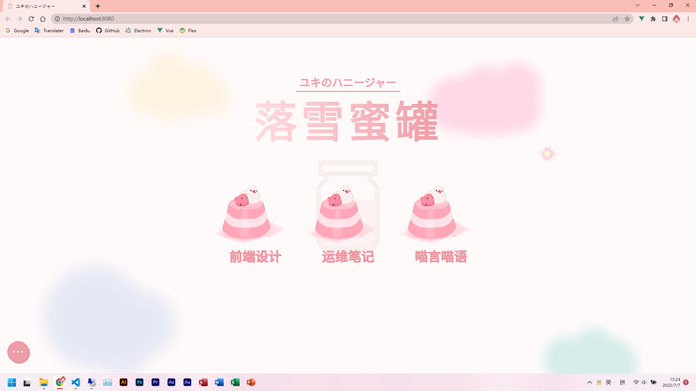
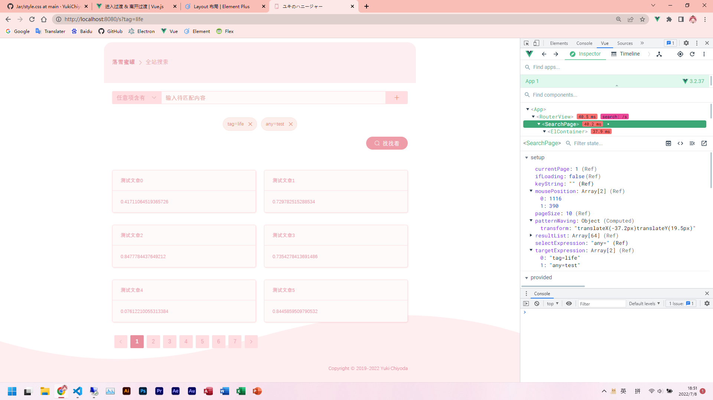

# ユキのハニージャー  
#### 🎶Yuki's Personal Blog!!~  
[🚀Enter](http://me.ooo.cat)  

## 🍪 Support
+ **Vue 3** for frontend  
+ **Element-Plus** for frontend  
+ **Golang** for backend  
+ **MarkDown** for plain text  
+ **MySQL** for database  

## 🐱 Permission
+ The frontend code is opensouced to those who obey [📕Yuki's Selfish License](./LICENSE).  
+ The backend code is private, but my friends can take a view.  
+ **Thank you for helping me find bugs or suggestions! [❤️Raise An Issue](https://github.com/YukiChiyoda/Jar/issues)**  

## ❓ Why English / Japanese / not Chinese?
+ ~~It seems to be more professional.~~  
+ ~~The author is truly twice-aped.~~  
+ To improve my poor English😭.  
+ English is more friendly for communication in Github.  

## 📷 How does it look like now?
   
   